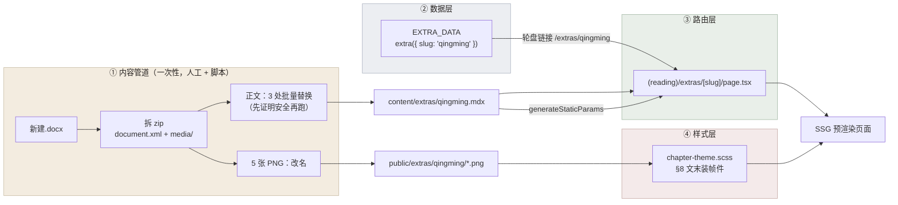
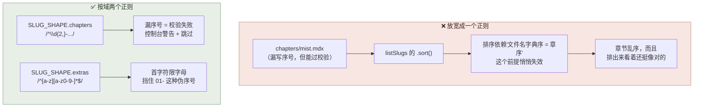
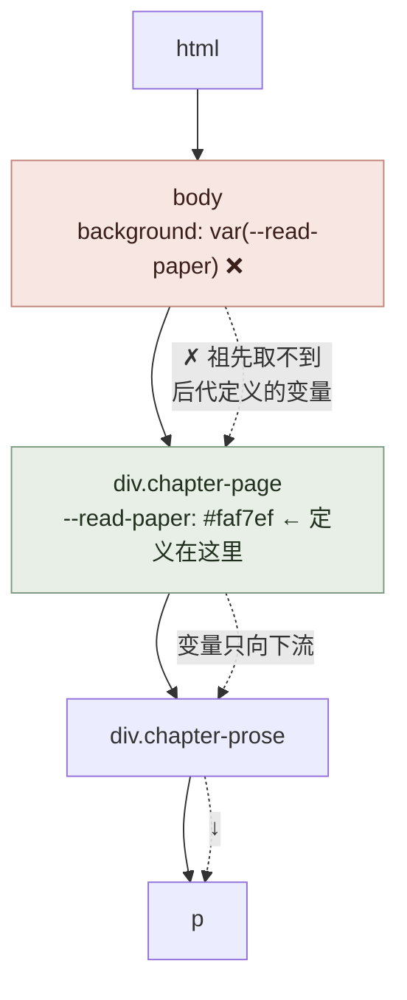
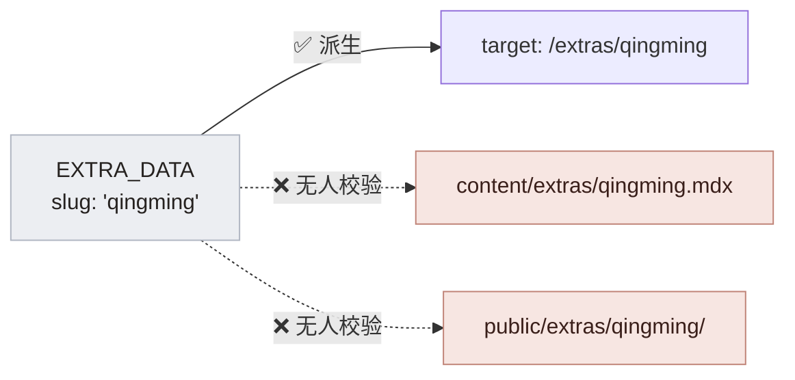

# 接入《清明》：为了让第一篇真文章跑起来，动了什么、为什么

> 面向"没时间看流水记录"的读者。逐步细节在 [`logs/2026-08-10-2-qingming-first-article.md`](../logs/2026-08-10-2-qingming-first-article.md)，这篇只讲**改了什么 + 为什么必须改**。

一句话：接入一篇文章不只是"加个 .mdx 文件"，它把**内容管道、数据层、路由层、样式层**四层各自的缺口一次性暴露了出来——因为在此之前，这四层从来没有被一条真实数据串起来过。

---

## 全景：一篇文章要穿过四层



四层里**只有 ① 是一次性的**，②③④ 的改动是给**所有后续文章**铺路。所以这次的工作量分布是"改结构 > 搬内容"。

---

## ① 内容管道：三处批量替换，都先证明了安全

docx 就是个 zip，正文在 `word/document.xml`。真正的风险不在"能不能抽出来"，而在**批量替换出错时你根本看不出来**——4500 字里错三个引号，肉眼扫不到，但读者会读到。

所以每一处都是**先统计、后替换**：

| 处理 | 先证明了什么 | 不证明会怎样 |
|---|---|---|
| 121 个 `＂`(U+FF02) → `“ ”` | 引号标记共 124 个、**偶数**；交替替换后零异常；单独验了跨段引用（[17] 开引号 → [18]~[22] 内层单引号独白 → [23] 才闭合） | `＂` 这个全角引号**不区分左右**，只能靠出现次序判断开闭。总数是奇数就说明有漏配，交替法会从那里开始**全篇左右颠倒** |
| 删 11 处半角空格 | 全文**零个 ASCII 字母** | 有英文单词时，半角空格承担分词职责，删了会把 `Amini NEWS` 变成 `AminiNEWS` |
| 正文直接进 MDX，不转义 | 扫了 `< > * _ [ ] { } \| & \` 和行首的列表/标题/引用记号，**命中数全为 0** | MDX 会把 `*` 当强调、`<` 当 JSX 起始。一个裸 `<` 就是编译报错；而 `*` 是**静默**变成斜体——中文排版里斜体是禁忌，等于悄悄破版 |

**顺带解决的一个歧义**：你说"段首已经有空格了"。查了发现那不是空格，是 Word 的段落属性 `w:ind w:firstLineChars="200"`（首行缩进 2 字）。这类缩进**不该进 MDX**——缩进由 CSS 的 `--read-indent` 统一给，写进内容里就成了第二个真源，将来想改成"段间距代替缩进"的排版风格会改不动。

**一个必须记住的坑**（下一篇会再遇到）：

```yaml
date: "2024.4"    # ⚠️ 引号是硬要求
```

裸写 `2024.4` 会被 YAML 解析成**数字** 2024.4，而 `readBaseMeta` 要 string，类型对不上。`2023.1-2023.7` 那种带连字符的反而天然安全。所以这个坑**只在"看起来像小数"的日期上出现**，最容易漏。

---

## ② 数据层：两个"单一真源"问题

### 调整 A：slug 规则按域拆开，而不是放宽

原来全站只有一个正则 `/^\d{2,}-[a-z0-9-]+$/`（形如 `01-mist`）。`qingming` 过不了。

最省事的做法是放宽成 `/^[a-z0-9-]+$/` 让两边都过。**没这么做**，因为：



**两个域的形状为什么天生不同**：

- **主线带序号**，因为序号是章节的固有属性（`ChapterMeta.chapter`）。带进文件名，`readdir` 的字典序就等于章序，`listSlugs` 才敢直接 `.sort()`。
- **番外不带序号**，因为番外顺序的唯一真源是 `EXTRA_DATA` 的**数组顺序**。文件名一旦带数字前缀，那个数字就成了第二个顺序真源——它和 `EXTRA_DATA` 一漂就是静默错序。

所以 `extras` 的正则**首字符限字母**：这不是洁癖，是主动挡住"给番外文件名加序号"这个看起来很自然、实际会埋雷的做法。

### 调整 B：`target` 从 `slug` 派生，不手填

`Story` 加了 `slug?: string`，路由由工厂算：

```ts
const extra = ({ slug, ...rest }: Omit<Story, "target">): Story => ({
  ...rest, slug,
  target: slug ? `/extras/${slug}` : "#",
});
```

考虑点：

- **为什么不手填 `target`**：手填等于 slug 和路由两个真源，写错的症状是**死链而不是报错**。
- **为什么不复用现成的 `id` 当 slug**：现有 id 里有大写和空格（`"new year"`、`"Qingming"`），过不了 slug 正则；而 `id` 已经被时间轴/轮盘当 React key 用了，改它会牵动那边。
- **`slug` 为什么可选**：缺省 = 正文还没进仓库（7 篇里目前只有《清明》有）。缺省时 `target` 是 `"#"`，轮盘照旧渲染、只是点不动——**不需要为"文章还没写"这件事写任何条件分支**。

---

## ③ 路由层：番外壳与章节壳**刻意重复**

`(reading)/extras/[slug]/page.tsx` 和 `(reading)/chapters/[slug]/page.tsx` 眼下只差 header 里一行元信息。没有抽公共组件。

理由：**它们的差异会越长越大**（番外没有上下篇、没有章序号、可能有专属装帧）。现在合并，代价是**每加一处差异就往里塞一个 boolean prop**——`isExtra`、`showDate`、`hasNeighbors`……那种组件读起来比两份重复代码更费劲。等差异稳定了再抽。

但**样式契约只有一份**：番外共用 `.chapter-page` / `.chapter-prose`，没有另起 `.extra-*` 一套。重复代码可以有，重复的排版真源不行。

一处有意的显示差异：

```tsx
<p className="chapter-meta">番外 · {meta.date}</p>
```

主线章节页**刻意不显示** date，番外显示。不是漏了：主线有两个时间（`storyYear` 世界内 / `date` 写作日期），摆出来得先想清楚给读者看哪个；番外只有 `date` 一个时间，而且它就是藏书阁轮盘上的标识——页面上不给，读者会对不上自己刚点的是哪一篇。

---

## ④ 样式层：文末装帧件

你的判断是这组图**像本文的赞助商**、且只有这篇有。所以：

- **写在 `qingming.mdx` 里**，不做成番外通用组件——只有一篇用的东西放进外壳层，等于让所有番外都背着它。
- **裸 `` 不用 `next/image`**：`public/` 路径拿不到自动尺寸，而这几张是 5~30KB 的透明 PNG，转 WebP 的收益抵不上多一层 loader。和 `mdx-components.tsx` 里对章节插图的判断一致。
- `width`/`height` **写死**是为了防 CLS，取的是 **docx 里的显示尺寸**（不是 PNG 像素尺寸），这样保留你手摆的相对大小关系。

### 从原稿坐标里读出的唯一一条设计依据

还原 `wp:anchor` 坐标后发现两件事：

```
docx 里四张下层图的位置（y 轴向下）
                                    ┌──────────┐
  ┌────────┐   ┌──────────────┐     │          │  ┌────────┐
  │ 书部记 │   │  老禾奶茶    │     │ 出品     │  │  NEWS  │
  └────────┴───┴──────────────┴─────┴──────────┴──┴────────┘
   底边 321      底边 322            底边 318      底边 321
   └──────────── 这是【按底线对齐】摆的 ────────────┘
                    ↓
        样式里的 align-items: flex-end 就是照这个来的
```

**`align-items: flex-end` 是 §8 里唯一有原稿依据的值**，其余数值（上间距 7em、题字下间距 3.2em、gap、小屏 600px 折 2×2）都是我定的，随时可改。

第二个发现是**那一行总宽 668px，正文栏只有 553px**——你原本是让它压过左右页边距的（出血）。**没有复现**：网页上做出血只能靠负 margin，而负 margin 在 600~800px 这段视口会把内容顶出屏幕（正文宽随视口收，负值不收）。拿一整类断点 bug，换一个读者只会看成"排版没对齐"而不是"故意压边"的效果，不值。

---

## 修掉一个我上一轮埋的 bug：纸色没铺到 body

实测 `body` 背景是 `rgba(0, 0, 0, 0)`（透明）。原因是自定义属性的**继承方向**：



`var()` 解析失败后，`background` 回退成 `initial`（transparent），**不是**回退成某个合理值——这是 CSS 变量最阴的一点：失败不是"降级"，是"整条声明蒸发"。

**为什么一直没发现**：Windows 上没有橡皮筋滚动，`body` 的背景根本不会露出来。只有 iOS / macOS 过度滚动时才会闪出一条全站冷白。

**修法**（考虑过两条路）：

| 方案 | 做法 | 为什么没选 / 选了 |
|---|---|---|
| 把 §1 整节提到 `:root:has(.chapter-page)` | body 也能读到变量 | ❌ 等于把**整份排版**押在 `:has()` 上——不支持时字号、行宽、缩进一起没 |
| 用编译期变量 `$paper` | `.chapter-page` 用 `#{$paper}`，body 直接用 `$paper` | ✅ 真源仍是一个；即使 `:has()` 不支持，丢的也只是回弹条的颜色 |

⚠️ 一个 Sass 陷阱：自定义属性里**必须写 `#{$paper}`**。Sass 把 `--x: …` 的值当纯 CSS token 流、不做变量替换，写成 `$paper` 会把这四个字符原样输出给浏览器然后静默失效。普通属性（`background: $paper`）反而直接写就行。

---

## 顺手发现的两件事（都没动）

### 1. Nav 和正文撞了 —— 这次终于有实证了

滚到中段时，正文行直接压在 `World | Codex | Characters` 上，两层字互相糊掉。Nav 是 `fixed` 且背景透明，而**阅读区是全站唯一会长时间滚动的页面**，所以只有这里会撞。

这把上一轮悬着的"长文阅读时顶栏要不要随滚动隐退"从**品味问题**变成了**缺陷**。属外壳层改动，没动。

⚠️ 加大 `--nav-clearance` **解决不了**——那只管页首的留白，滚到中段照样撞。

### 2. `logo-amini-presents` 少一个 `TM` 角标

Word 里那个 TM 是**独立文本框**，没进 PNG（截图确认老禾奶茶和 Amini NEWS 的 TM 都在）。要补最干净是重新导出一张带 TM 的图，代码侧没补——这是内容层的事。

---

## 还剩一个**已知未修**的风险

`EXTRA_DATA.slug` 和 `content/extras/*.mdx` 的对齐**没有构建期校验**：



写成 `qingming` 而文件叫 `qing-ming.mdx`，结果是**一个 404 链接，构建不报错**。这条从 08-06 就记着，之前是理论风险；这次真接了一篇进来，它变成现实风险了。`slugShape(dir)` 已经导出给域外校验脚本用，写个校验器就能关掉——这是下一步优先级最高的一件小事。

---

## 验证过的东西

`tsc --noEmit` exit 0；`pnpm build` exit 0 且 `/extras/qingming` 是 SSG 预渲染；1440 / 768 / 700 / 390 四个视口零横向溢出；18px 下 34 字/行；装帧区桌面一行、底边参差 0px、390 折 2×2；对话段首行缩进精确 2em；`body` 纸色修复后 `rgb(250,247,239)`。

上一轮 log 里标 ⏳「没有真图、`p:has(> img)` 没跑过」的那条，这次有真图了，已验证。

**方法论上踩的两个坑，都是"别信眼睛，先量"**：

1. 我用"有几个不同的 `y` 值"数装帧件折了几行，四个视口都报 4 行。**是探针错的**——`align-items: flex-end` 让高度不同的图有不同 `top`。真相在 `bottom`。
2. 截图里宋体正文看着偏蓝偏棕，标题却是纯黑，像是 `--read-ink` 没生效。量了才知道颜色完全正确（都是 `rgb(38,34,32)`），那层彩色是**子像素抗锯齿**：宋体细笔画只有 1px 宽，彩边占满整个笔画；标题笔画粗所以看着纯黑。真机上看不见。
